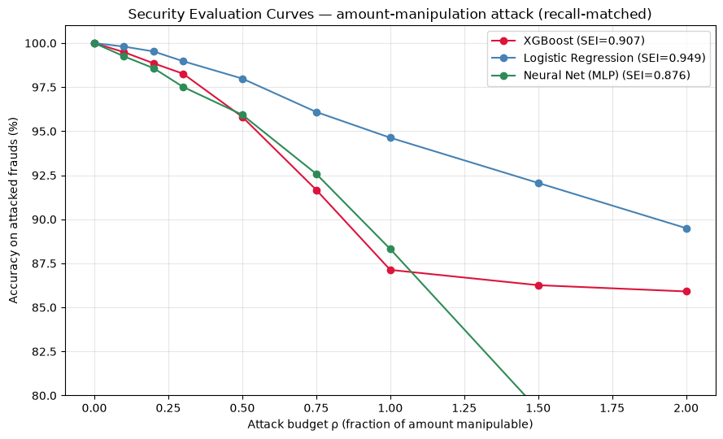

# Adversarial Robustness of Fraud Detection Models

A follow-on study to [credit-card-fraud-detection](https://github.com/lakshyakaviya/credit-card-fraud-detection), which built a leakage-safe fraud detection pipeline on the [IEEE-CIS dataset](https://www.kaggle.com/competitions/ieee-fraud-detection). That project asked *how well can we detect fraud?* This one asks the question that matters once a model is deployed: **what happens when the fraudster knows the model exists and adapts?**

**Headline finding: predictive accuracy does not predict adversarial robustness.** Across three model families, the ranking by held-out PR-AUC and the ranking by robustness disagree completely.

| Model | Test PR-AUC (accuracy) | SEI (security) |
|---|---|---|
| XGBoost | **0.507** — best classifier | 0.907 |
| Logistic Regression | 0.175 — worst classifier | **0.949** — most robust |
| Neural Net (MLP) | 0.249 | **0.876** — least robust |

---

## Motivation

Standard model evaluation assumes the data-generating process is static. Fraud violates that assumption by construction — fraudsters observe which transactions get blocked and adjust. A model with excellent held-out PR-AUC can still be trivially evadable if its decision boundary depends on features the attacker controls.

The question this project answers is not "is the model accurate?" but "how much accuracy does an adapting adversary cost us, and which model architecture degrades most gracefully?"

---

## Threat model

Adversarial ML research on images typically assumes an unconstrained perturbation budget under an L-p norm. That assumption is wrong for tabular fraud data, because most features are not attacker-controllable. A fraudster cannot retroactively change the card's transaction history, the issuing bank, or the device fingerprint.

This project therefore defines a realistic, constrained threat model:

| Element | Specification |
|---|---|
| Attacker goal | Evasion — get a fraudulent transaction scored below the decision threshold |
| Attacker knowledge | Query access to the trained model (see note below) |
| Manipulable features | `TransactionAmt` only |
| Coupled features | `amt_z_for_card`, recomputed whenever the amount changes |
| Frozen features | 424 features — card-level aggregates, temporal features, `V`/`id` blocks, categorical identifiers |
| Budget (ρ) | Multiplicative bound on the amount: `[orig × (1−ρ), orig × (1+ρ)]`, swept 0 → 2 |

Restricting the attack surface to a single manipulable feature is the point, not a limitation. It reflects what an attacker can actually do at transaction time, and it makes the resulting robustness estimate meaningful rather than pessimistic-by-construction.

**Features considered and deliberately excluded:**

- `hour` — a fraudster does choose transaction timing, but it is effectively categorical (0–23) and carries little standalone signal.
- `ProductCD_*` — one-hot encoded; continuous perturbation would yield fractional category memberships corresponding to no real transaction.
- `card6_credit` / `card6_debit` — **a stolen card's type is fixed.** A fraudster cannot transmute a debit card into a credit card. This is a property of the stolen instrument, not a lever.

`amt_z_for_card` is *derived* from the transaction amount (its z-score against the card's spending history), so it is recomputed rather than perturbed independently — letting the two move separately would construct an internally inconsistent transaction.

**A note on attacker knowledge:** this implementation assumes direct query access to the victim model, which is the stronger assumption. The referenced framework (Xiao et al.) addresses the harder black-box case, where the attacker trains a substitute model and relies on adversarial transferability. Extending to that setting is future work; the robustness numbers here should be read as an upper bound on attacker capability, and therefore a lower bound on model security.

---

## Methodology

**Attack.** Vectorised grid search over the perturbation budget for `TransactionAmt` — for each fraudulent transaction, 50 candidate amounts within the budget are evaluated in parallel rather than looping per transaction. A transaction counts as evaded if *any* candidate amount drops the model's score below its decision threshold.

Because the threat model permits only one manipulable feature, the attack needs no gradients — which has a useful consequence: **it applies directly to non-differentiable models.** XGBoost, which would normally require a substitute-model transfer attack, is attackable by direct search in one dimension. The narrow threat model made the hardest target tractable.

**Recall-matched operating points.** Raw probability thresholds are not comparable across model families — a score of 0.5 represents a different operating point for XGBoost, logistic regression, and a neural network, because each calibrates probabilities differently. Comparing security at a shared raw threshold conflates genuine robustness with the accident of where each default cutoff sits, and a stricter threshold *inflates* apparent robustness because only the model's highest-confidence (hardest to flip) predictions are ever attacked.

Each model's threshold is therefore tuned so all three catch **the same 82.2% of fraud on clean data** before the attack begins:

| Model | Threshold for 82.2% recall | Frauds attacked |
|---|---|---|
| XGBoost | 0.300 | 2,533 |
| Logistic Regression | 0.357 | 2,533 |
| Neural Net (MLP) | 0.236 | 2,533 |

All three now start from an equivalent detection system, so any difference in degradation is attributable to the models themselves rather than to threshold placement.

**Security Evaluation Index (SEI).** Following Xiao et al. (eq. 11–12), the SEI is the normalized area under the `Acc(ρ)` curve — the average share of its detections a model retains across the attack-strength range. Range [0, 1]; higher is more secure.

**Compute.** PyTorch with CUDA (NVIDIA GTX 1650) for the MLP; XGBoost and scikit-learn on CPU.

**Victim models.** The three model families trained in the parent project — logistic regression, XGBoost, and a PyTorch MLP.

---

## Results



All three curves begin together at 100% (recall-matched, no perturbation) and fan out as the attack budget grows.

**Logistic regression (SEI 0.949) is the most robust**, despite being by far the weakest classifier. Its linear response to the amount means perturbations move the score smoothly and predictably, offering no discontinuity to exploit.

**XGBoost (SEI 0.907) shows a distinctive elbow** — a steep decline to ρ ≈ 1.0, then a plateau at ~86%. The early drop reflects the model's discrete, threshold-based splits: pushing an amount across a split boundary produces a sudden score change. The plateau is more interesting — it indicates a hard core of frauds that amount manipulation **cannot evade at any budget**, because the model convicts them on the 424 frozen features the attacker cannot touch. Even at ±200%, a manifestly unsubtle perturbation, ~86% of detections survive.

**The MLP (SEI 0.876) is the least robust**, declining steadily to 24.9% evasion at ρ = 2.0 with no plateau. Smoothness alone does not guarantee robustness — what the network actually learned matters, and its decision surface evidently contains regions an amount-only attack can exploit.

### The mechanism

Evasion rates are low overall because of **feature dependence**. XGBoost's decision boundary leans heavily on card-level aggregate and counting features — the frozen part of the feature vector — rather than on the raw transaction amount. An attacker manipulating only the amount is pushing on a lever the model barely uses.

This connects directly to a finding from the parent project, where SHAP analysis ranked `TransactionAmt` only 4th in importance, behind the `C` counting features that form the model's backbone. **Feature choices made for predictive reasons turned out to have robustness consequences that were never designed for** — and the models that lean hardest on attacker-inaccessible features are structurally the hardest to evade.

### The trade-off

There is no monotonic relationship between accuracy and robustness here. The best classifier is middling on security; the worst classifier is the most secure; the middle classifier is the least secure. Selecting a fraud model on predictive performance alone conveys no information about how it will behave against an adaptive adversary — which is the practical argument for evaluating both.

---

## Methodology note

An implementation error in the initial MLP attack — perturbed amounts were written to the coupled z-score column rather than the amount column, leaving `TransactionAmt` unchanged — inflated that model's apparent robustness to SEI 0.967. The error was caught while refactoring the attack into a reusable module, and confirmed by cross-validation: after the fix, XGBoost and logistic regression reproduced their original SEIs *exactly* while only the MLP's changed, isolating the fault unambiguously. Two independently corrected implementations agree to within 0.005. The reported value is the corrected one.

This is recorded because the bug was silent. The code ran without error, the degradation curve was monotonic, and the ρ = 0 sanity check passed. Structural sanity checks do not catch a wrong column index.

---

## Limitations & future work

- **Single-feature threat model.** Robustness here is specifically to *amount* manipulation. A broader attack surface, or a different budget definition, could reorder the models.
- **White-box query access.** The black-box setting of the reference paper — substitute-model training plus adversarial transferability — is the natural extension and a harder, more realistic test.
- **Modest absolute differences.** The SEIs span 0.876–0.949; all three models are reasonably robust to amount manipulation. The finding concerns their *relative* ordering, not that any model is insecure.
- **No defense evaluated.** Adversarial retraining, or deliberately reducing model reliance on manipulable features, would close the loop.
- **Non-adaptive attack.** A 50-point grid is exhaustive within the budget but not iterative; a gradient-guided attack on the differentiable models might find evasions the grid misses.

---

## Repository structure

```
.
├── notebooks/
│   └── fraud_attack_security_models.ipynb   # threat model, attack experiments, SEI analysis
├── src/
│   ├── attacks.py                    # attack functions, SEI, recall matching
│   └── features.py                   # feature pipeline (copied from parent project)
├── images/
│   └── security_evaluation_curves_combined.png
│   └── security_evaluation_index_XG.png
├── requirements.txt
└── README.md
```

## Reproducing

```bash
git clone https://github.com/lakshyakaviya/adversarial-robustness-fraud
cd adversarial-robustness-fraud
python -m venv .venv && source .venv/bin/activate
pip install -r requirements.txt
```

`requirements.txt` pins the CPU build of PyTorch. For GPU acceleration (used here for the MLP attack):

```bash
pip install torch --index-url https://download.pytorch.org/whl/cu121
```

The IEEE-CIS dataset is not committed to this repository. Download it from the Kaggle competition page (accept the competition rules first):

```bash
kaggle competitions download -c ieee-fraud-detection -p data/
unzip data/ieee-fraud-detection.zip -d data/
```

Trained models and feature artifacts are produced by the parent project — run its notebook to generate `data/train_data_merged.parquet`, `models/xgb_baseline.pkl`, and `models/fraud_mlp.pt` before running the attack notebook here. `src/features.py` is duplicated in this repository so the attack pipeline is self-contained; it is identical to the parent project's.

---

## Reference

Jin Xiao, Yuhang Tian, Yanlin Jia, Xiaoyi Jiang, Lean Yu, Shouyang Wang (2023). *Black-Box Attack-Based Security Evaluation Framework for Credit Card Fraud Detection Models.* INFORMS Journal on Computing.

## Related

[credit-card-fraud-detection](https://github.com/lakshyakaviya/credit-card-fraud-detection) — the fraud detection pipeline this study attacks.

---

*Built by Lakshya Kaviya — github.com/lakshyakaviya · lakshyakaviya2003@gmail.com*
